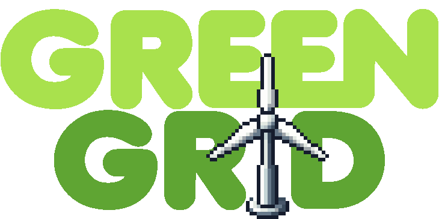

# Green Grid - Das Energie-Puzzle



Green Grid is a strategic simulation game where players manage a city's renewable energy infrastructure. The goal is to balance power generation with energy consumption while minimizing CO₂ emissions. The game features an interactive isometric tile map, a dynamic day-night cycle, and various renewable energy sources like wind turbines, solar panels, and hydroelectric plants.

## Features

- **Strategic Energy Management:** Place and optimize renewable energy sources to power your city efficiently.
- **Dynamic Isometric Tilemap:** A procedurally generated grid for placing buildings and power sources.
- **Day-Night Cycle:** A smooth transition between day and night affecting energy production.
- **Interactive Map Navigation:** Scroll and pan across the map to explore and plan your city.
- **Smooth UI and Graphics:** Lightweight, optimized for mobile performance.

## Installation

### Prerequisites

- Java 8+
- Android Studio (for mobile development)
- LibGDX framework installed

### Running the Game

1. Clone the repository:
   ```sh
   git clone https://github.com/your-repo-name/green-grid.git
   ```
2. Open the project in **Android Studio** or your preferred IDE.
3. Build and run the game:
   ```sh
   ./gradlew android:installDebug   # For Android
   ```

## Gameplay Overview

### Energy Sources

- **Wind Turbines:** Generate energy based on wind conditions.
- **Solar Panels:** Work efficiently during daytime, but not at night.
- **Coal Plants (Starting Energy):** Pollute but provide constant power.

### Game Mechanics

- **Energy Demand Fluctuation:** The city's energy consumption varies based on time of day.
- **Scrolling & Panning:** Drag the screen to navigate the map.
- **Dynamic Lighting:** The background color changes smoothly based on a sinusoidal day-night cycle.

## Saving & Loading Data

- **Settings:** Stored using LibGDX Preferences API.
- **World Data:** Saved as JSON for easy storage and retrieval.
- **Binary Save Option:** Optimized storage for large-scale maps.

## Roadmap & Future Features

- **Weather System:** Affect wind turbine efficiency.
- **Energy Storage:** Implement battery storage mechanics.
- **Advanced Graphics:** Add animation effects to power sources.

## Contributing

Feel free to fork the repository and submit pull requests!

## License

This project is licensed under the MIT License.

## Contact

For questions or feedback, contact [your_email@example.com] or visit [your_project_website].
